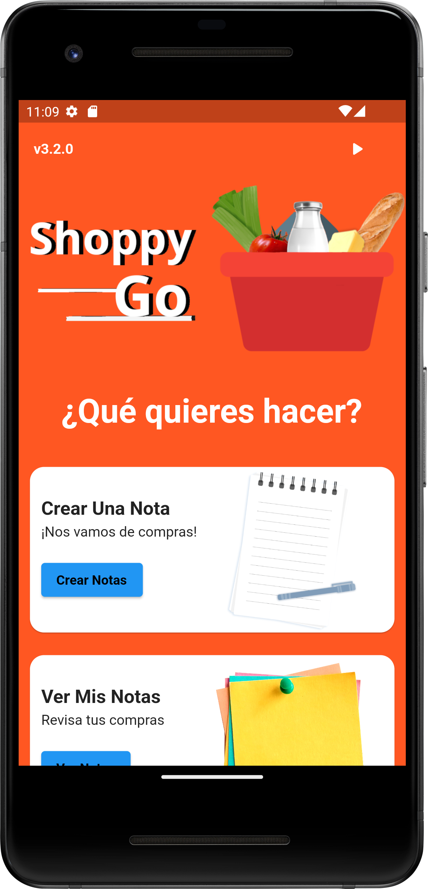
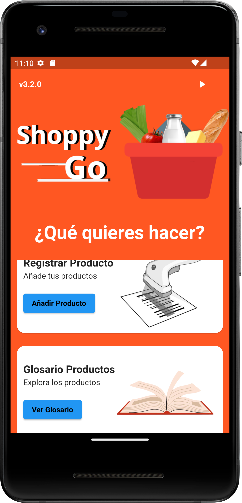
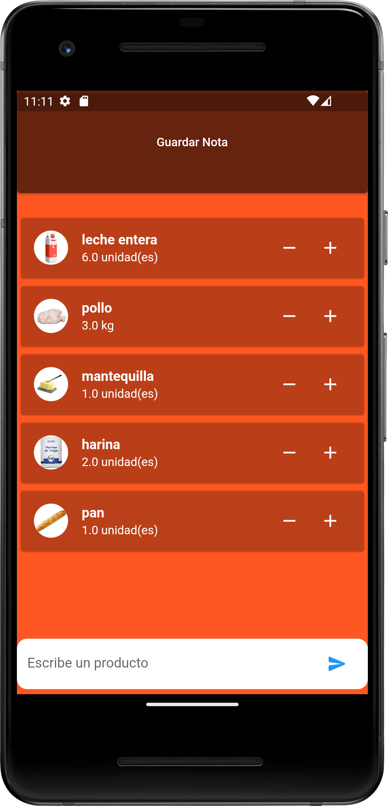
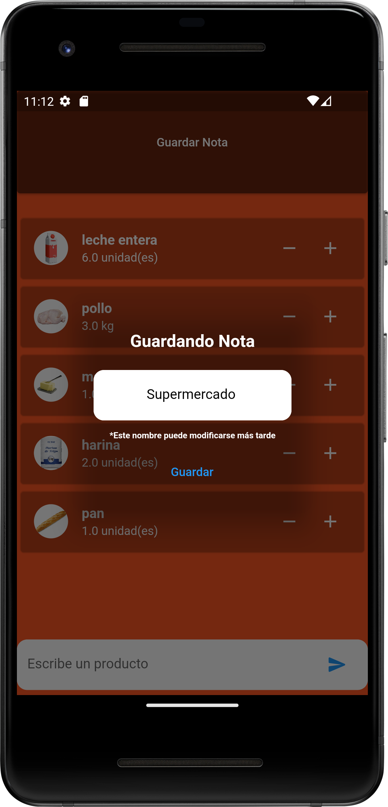
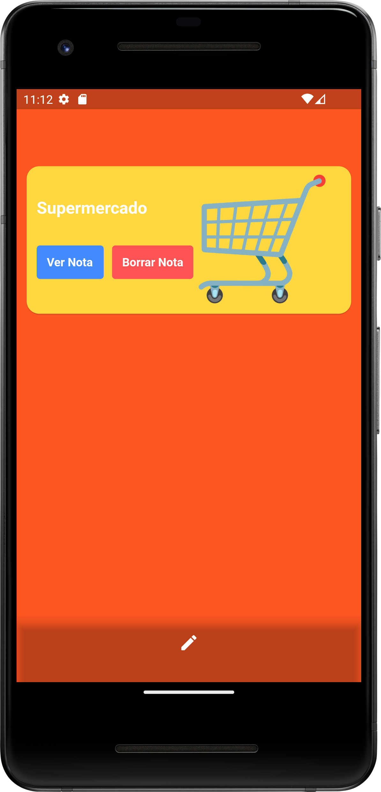
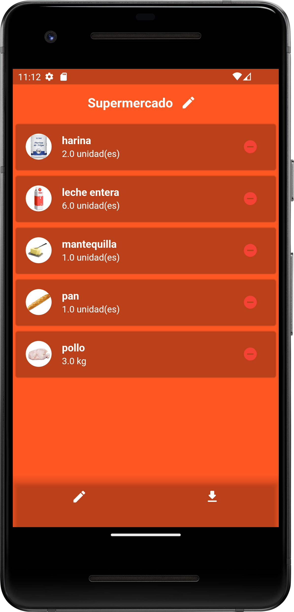
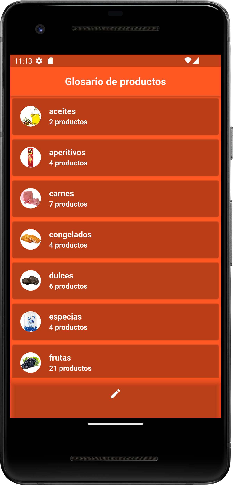

 


 # Shoppy Go
Aplicación para gestionar la compra del supermercado
Crea notas para distintas situaciones y ten un registro de ello

# Platform Tested Compatibility

- [x] android
- [ ] web
- [ ] linux desktop
- [ ] windows desktop
- [ ] iOS
- [ ] fuchsiaOS

# Dependencies
All plugins used on this project
```
dependencies :
  flutter_launcher_icons: ^0.10.0
  path_provider: ^2.0.11

```

# Permissions
All permissions required for this application
```
    <uses-permission android:name="android.permission.WRITE_EXTERNAL_STORAGE" />
    <uses-permission android:name="android.permission.INTERNET"/>

```

 # Screens








